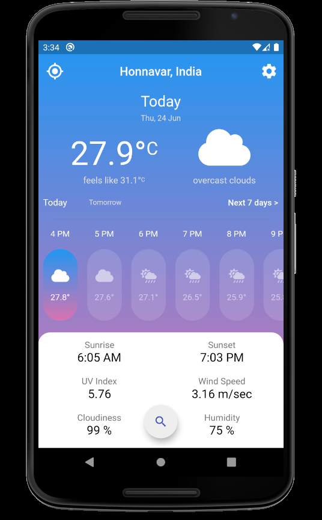
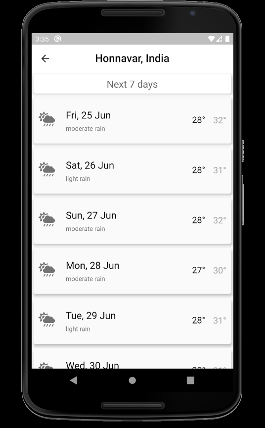
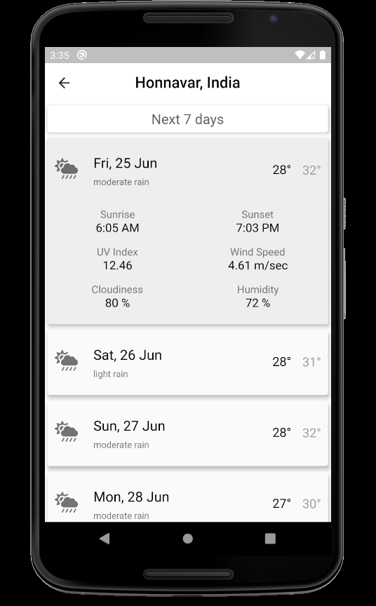
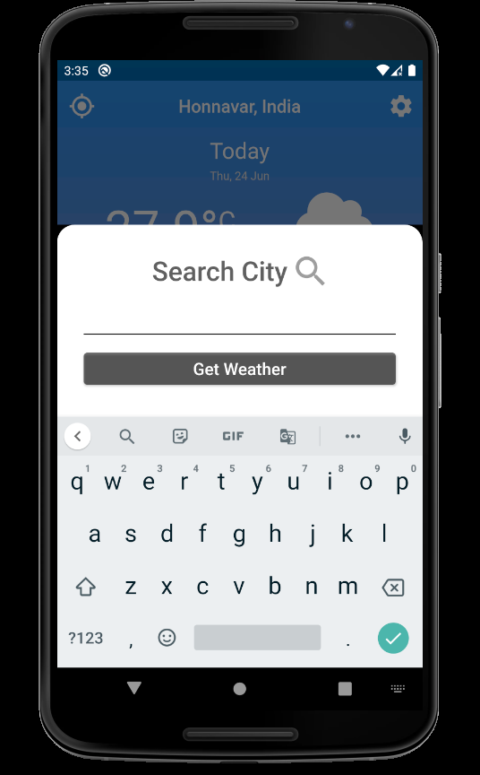
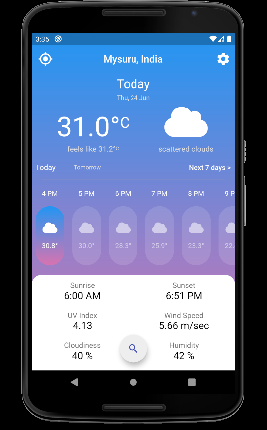
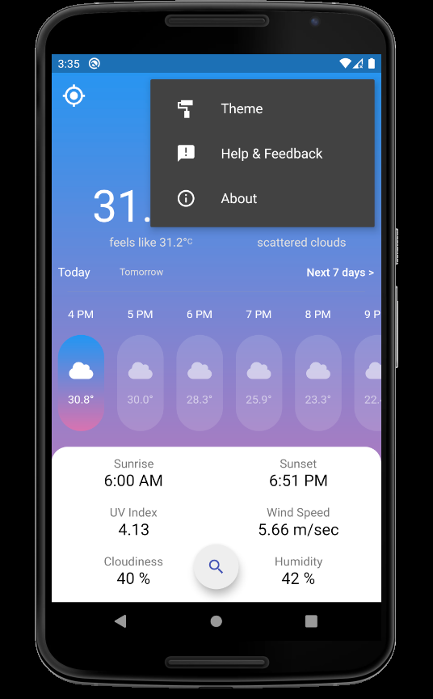
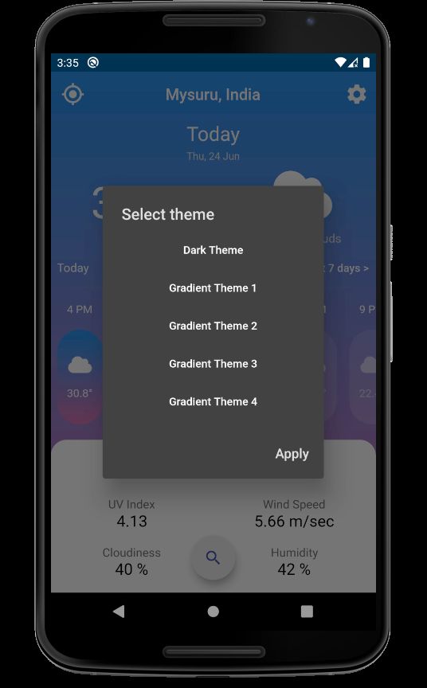
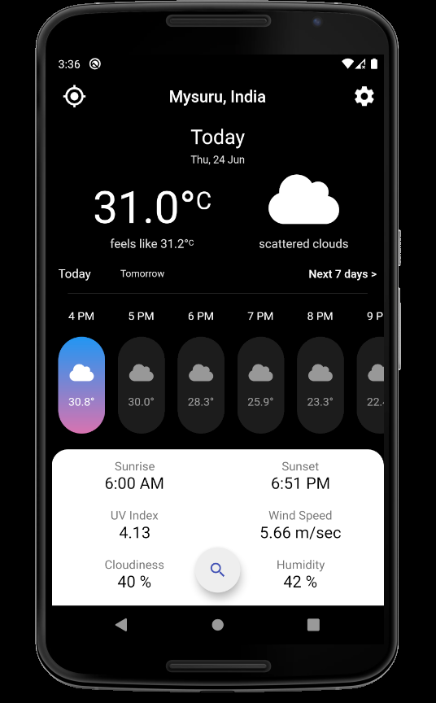
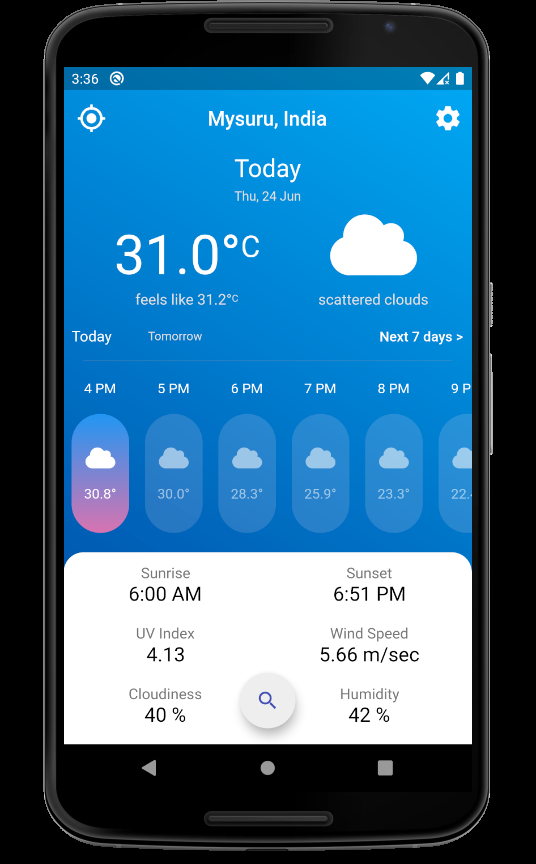

# Weather App

A flutter weather app that provides with current location's weather along with hourly and daily forecast.We can also search for particular city's weather.


## Features

- Current location weather
- hourly weather forecast of next 24 hours
- daily weather forecast of next 7 days
- Search for particular city's current weather and weather forecast

## Preview of Weather App




<br>



<br>



<br>

## Note for cloning

Create a file called `secrets.dart` in `/utilities` folder.
```dart
const API_KEY='asjahsjhalksjakjska';//your API key here 
```

Get your API key from [Open Weather Maps API.](https://home.openweathermap.org)

## Queries

If you have any queries contact me [Vishal Rajkumar Naik.](mailto:vishalrajkumar13232@gmail.com)


