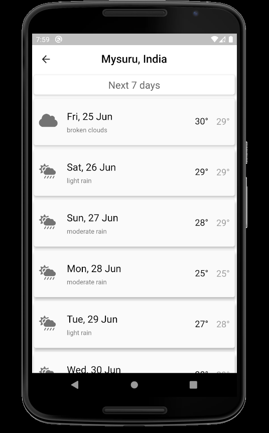
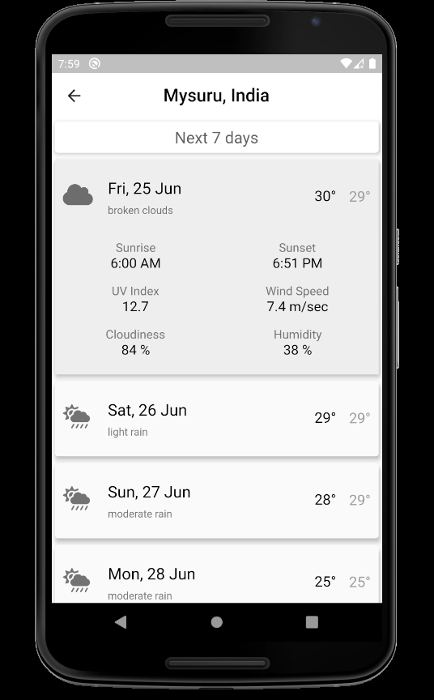
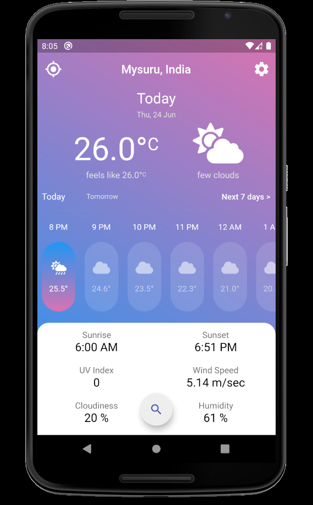
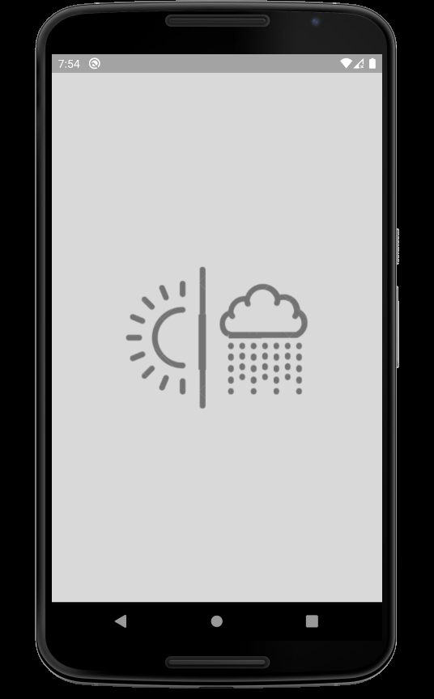

# Weather App

A flutter weather app that provides with current location's weather along with hourly and daily forecast.We can also search for particular city's weather.


## Features

- Current location weather
<div style="display:inline">

</div>

- Hourly weather forecast of next 24 hours
<div style="display:inline">

</div>

- Daily weather forecast of next 7 days
<div style="display:inline">


</div>

- Search for particular city's current weather and weather forecast
<div style="display:inline">




</div>

- Change background theme from set of themes provided.Dark mode is also available.
<div style="display:inline">



</div>

## More pictures of Weather App

<div style="display:inline">



</div>
<div style="display:inline">


</div>
<div style="display:inline">


</div>

## Note for cloning

Create a file called `secrets.dart` in `/utilities` folder.
```dart
const API_KEY='asjahsjhalksjakjska';//your API key here 
```

Get your API key from [Open Weather Maps API.](https://home.openweathermap.org)

## Queries

If you have any queries contact me [Vishal Rajkumar Naik.](mailto:vishalrajkumar13232@gmail.com)


